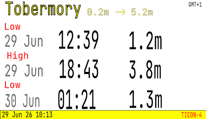
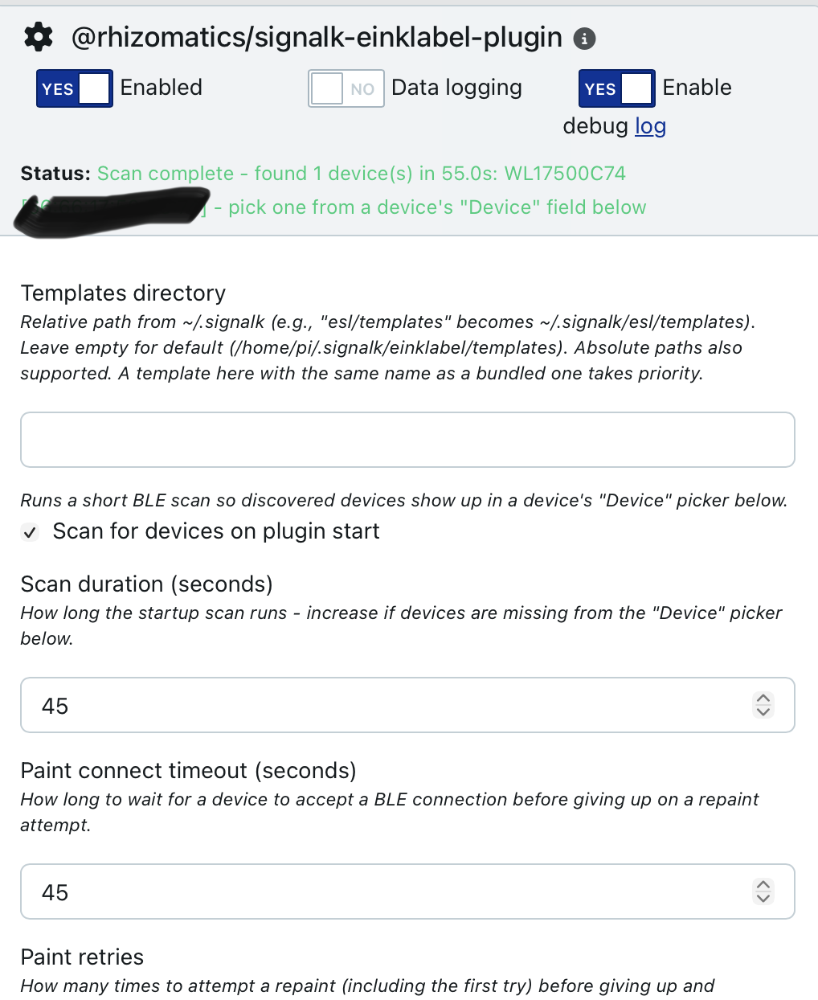
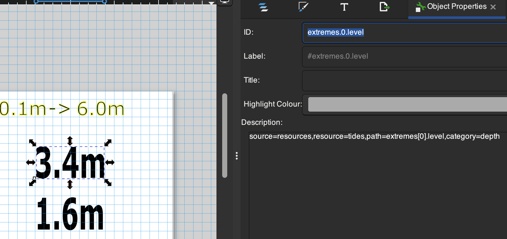

# eInk Labels for SignalK

[](https://www.npmjs.com/package/@rhizomatics/signalk-einklabel-plugin)
[](https://www.npmjs.com/package/@rhizomatics/signalk-einklabel-plugin)
[](https://github.com/rhizomatics/signalk-einklabel-plugin/actions/workflows/signalk-ci.yml)
[](https://codecov.io/gh/rhizomatics/signalk-einklabel-plugin)
[](https://github.com)
[](https://github.com/rhizomatics/signalk-einklabel-plugin/blob/main/LICENSE)

    Fully working but limited vendor/product support and requires Linux for device access.

A SignalK plugin to display data from SignalK paths, APIs and plugins on Electronic Shelf Labels (ESL) over a Bluetooth Low Energy (BLE) connection using simple SVG templates.

## What is an ESL?

Electronic Shelf Labels are [eInk](https://en.wikipedia.org/wiki/E_Ink) devices that consume very little battery energy, presuming they are not constantly updated - the battery is used only when the display changes (which can take 5-10 seconds) and a periodic BLE check for incoming changes. Perfect for info that changes only once or twice a day, like tidal information.

Since they are designed to be used in large quantity in small shops, they are cheap and simple devices. Earlier models required dedicated controllers, or updates over Wifi or NFC, whereas many modern ones are standalone BLE devices that can be updated from a phone or server.

Being battery operated, they can be stuck on anywhere without wiring - the only location constraints are bluetooth range, visibility (they need ambient light since the display is more like paper than a traditional lit-up electronic display) and out of the weather since the devices are intended for indoor use.

## Pre-requisites

Unlike some eInk projects, this plugin doesn't require any physical modification to the labels, or loading any new firmware. It can send an image to a supported shelf label fresh out of the box.

Most of these requirements are about making SignalK work with Bluetooth Low Energy, which is good thing to have anyway, since vendors like Victron, Switchbot, Ruuvi and others have BLE enabled hardware that's useful to have on a boat. [Direct BLE support](https://github.com/SignalK/signalk-server/issues/2411) in SignalK is being planned in 2026.

1. A SignalK server, **running Linux**

- MacOS and Windows aren't supported by the [BLE interface layer](https://www.npmjs.com/package/@naugehyde/node-ble), however can be used for template development and
  debugging (everything except `scan` and `paint`)

2. A Bluetooth adapter, that can handle BLE (Bluetooth Low Energy), which is Bluetooth v4.0 or higher

- Bluetooth adapters for Linux can be tricky, TP-Link UB400 and Asus USB-BT500 are two well-known and available ones
- Some Raspberry Pi models come with suitable Bluetooth it built-in
- Don't worry about the very latest Bluetooth versions, 4.0 is basic, 5.0 is nice
- Home Assistant is massively more popular than SignalK, and often also run on Raspberry Pi and similar, so good source of advice

3. `bluez` package installed in Linux

- No need to do this if you have a Raspberry Pi with recent Raspian version, since bluez comes built in.
- If you're not running a Raspberry Pi, then ensure that the `dbus` package is installed

4. One or more supported Electronic Shelf Labels

- The label used for testing this is the [ZhunyCo 3.7 BRWY](https://www.aliexpress.com/item/1005010050104435.html)

5. Correct time zone set on server if local time is to be shown on display

- See [FAQ](#faq-timezone)
- If not set, everything will work, but you may see the wrong zone or not have daylight savings applied

Once you have all of that, it may be worth also installing [signalk-victron-ble](https://github.com/stefanor/signalk-victron-ble) or [bt-sensors-plugin](https://github.com/naugehyde/bt-sensors-plugin-sk) to pull in data from other sensors and equipment.

## Installation

Look for **eInk Label Instrument** in the [SignalK AppStore]() on your
server ( under _Apps & Plugins_ on the latest version).

### Using Outside of SignalK

The plugin can also be installed as a stand-alone module, which can be useful for designing templates away from the boat, and makes available the `esl-cli` command line tool for scanning devices and debugging templates.

```bash
npm install @rhizomatics/signalk-einklabel-plugin
```

## Examples

### Tide Clock



Template available as 416x240-BWRY for 3.7" ESLs and a simpler template, sized 250x128, also BWRY, for the cheapest 2.13" labels.

#### Pre-requisites

* [signalk-tides](https://github.com/openwatersio/signalk-tides) plugin to be installed and publishing tides to the Resources API. 
  - The [tides](https://github.com/rhizomatics/signalk-einklabel-plugin/blob/main/templates/tides/) templates can be customized to run with other APIs or take data only from SignalK data paths. 
  - In the template it uses paths like `source=resources,resource=tides,provider=tides,path=extremes[0].time,format=local_time` to get the first tide time, ensures its the preferred `signalk-tides` provider and makes it a simple local time rather than a UTC date time.
* To show the lunar phase, the `environment.moon.phaseName` path is required, which can
be easily achieved by installing and configuring the `derived-data` plugin.

## Configuration

Use the standard configuration option in the SignalK menu for the plugin.



### Scanning for Devices

Since these are ultra-low power devices, they don't respond instantly to either identify themselves or accept a new image. By default, both scanning and painting have time-outs to wait for a response, which can be altered in the plugin configuration or CLI argument.

One other quirk is that some devices respond with a different name at different times, for example the genric `WOESL` sometimes and model specific `WL17500C74` other times. However, the MAC address, e.g. `66:66:17:50:0D:2B` is constant, and this is what's tracked by the plugin.

The plugin can optionally re-scan whenever it starts up (off by default), although this isn't essential once a label has been configured. Devices found by any scan are remembered across restarts - see the FAQ below.

#### Selecting a Device

A device's "Device" field can either be a specific device picked from the scan dropdown, or **"All discovered devices"**, which paints that same template/trigger to every device the plugin currently knows about. This is the simplest option for a boat with just one label - there's no need to scan first and pick it out, and if nothing's been discovered yet, selecting it triggers a scan itself the first time it's needed. It also covers several identical labels with one config entry, without listing each one out.

### Scheduling

There are two ways of scheduling scans:

#### Time Based

This will schedule at fixed hours of the day, for example 00:00/08:00/16:00 for an 8h schedule, and at a selected minutes past the hour. At plugin startup/restart, the devices will be repainted if they missed their last slot.

#### Path Subscription

The devices will be painted when the plugin starts, and then every time the selected SignalK path changes.

## Templating

Templates are simply SVG files, to which expressions can be added to use SignalK data, with options to make it easier to read, like rounding or simplifying dates and times. The template can have sample data in the placeholder, so is easy to layout and visualize.

### Template Families (multiple panel sizes/colours)

A "Template" selection can either be one specific `.svg` file, or a _directory_ holding several same-purpose templates for different panel sizes/colour-sets, e.g. `templates/tides/416x240-BWRY.svg` and `templates/tides/250x128-BWRY.svg` both implement the tide clock, just at different sizes. Each file is named `<width>x<height>-<colours>.svg`, where `<colours>` is one letter per supported colour: `B`(lack)/`W`(hite)/`R`(ed)/`Y`(ellow) - e.g. `BWRY` for a 4-colour panel, `BWR` for a 3-colour one.

Selecting the directory (e.g. `tides`) instead of one file lets one `DeviceConfig` entry - especially a `device: "All discovered devices"` entry covering several different physical panels - automatically pick the best-fitting file for each device's actual size/colours, trying in order:

1. An exact width/height/colour-set match.
2. Failing that, width/height alone (any colour-set).
3. Failing that too, the nearest width, tie-broken by whichever file's own height/width ratio is closest to the device's.

### Template Source Specification

In the `description` of the SVG text box, use a comma separated set of key value pairs to define the data source and formatting.

#### SignalK Paths

For example, `path=environment.forecast.description` uses the default data source (the `self` vessel context) and the named SignalK path. A bare path with no key/value pairs at all, e.g. just `environment.forecast.description`, is shorthand for the same thing. Overriding the default context can be done with `path=environment.forecast.description,context=vessels.urn:mrn:imo:mmsi:232345678` - the `context` value must match a real SignalK context exactly as it appears in the Data Browser.

#### SignalK REST APIs

The source can be overridden to use the SignalK server's Resources API instead. Change `source` to `resources` and specify which resource with `resource`. If there are multiple providers for the same resource, and they're not equally useful, then either set a default provider in SignalK, or use the `provider` tag to set the name.

For example, `source=resources,resource=tides,provider=tides,path=station.name` picks the `tides` resource and pulls the `station.name` path out of the JSON response - this works for any resource type (`tides`, `waypoints`, `routes`, ...), and needs nothing configured: the plugin reaches the Resources API directly. Where a resource is specified, it will be fetched once for that render, and subsequent fields sourced from the same resource use that cached response. `provider` is optional, the default provider will be used if not specified.

#### Plugin Data

`source=einklabel` reads data injected by the plugin itself, rather than from SignalK. Available paths:

- `path=repainted` - the timestamp of the current repaint - for example `source=einklabel,path=repainted,format=local_datetime_short` to show when the label was last updated.
- `path=local_zone` - a short zone name (e.g. `BST`) for the same timezone used for `local_time`/`day_mon`/`local_datetime_short` (see above) - a fallback for `environment.time.timezoneRegion,format=utc_offset` on installs that never publish that path, since it needs no SignalK metadata of its own. Falls back to a plain UTC offset like `GMT+1` where the host's locale has no real abbreviation for the zone.
- `path=plugin_version` - expose the version of the eInk Label plugin itself.

#### Customizing Output

A `format` can be specified to make the value easier to understand. The supported formats are:

- `local_time` - reduce a time stamp to just the time (H:M:S), omitting the date, and applying daylight savings if appropriate
- `day_mon` - reduce a time stamp to day and month, e.g. `27 Jun`, applying daylight savings if appropriate
- `local_datetime_short` - format a time stamp as day, abbreviated month, 2-digit year and 24h time, e.g. `21 Jun 26 18:05`, applying daylight savings if appropriate
- `utc_offset` - Show a timezone in `UTC+01:00` style format
- `position` - Format a `{ latitude, longitude }` value as decimal degrees with hemisphere letters, e.g. `56.6250°N 6.0700°W`
- `raw` - Don't apply automatic SignalK unit conversion and symbol display (see below)

SignalK's unit preferences are used to automatically convert a `signalk`-sourced numeric value to its preferred display unit, and append a unit symbol like `kt` or `m`, unless `format=raw` is specified to switch that off. However, when using plugin or API data there may be no path metadata to convert from (for example `signalk-tides` publishes tide data to the Resources API, and `level` is a raw metre value with no SignalK path of its own) - in these cases an explicit `category` can be given instead, and the unit preferences will be applied the same way, for example `category=depth` for the tides level figure.

Note that for dates and times, the server timezone must be set correctly, for example `Europe/London` rather than the default `Etc/UTC`. This can be done on Linux using `timedatectl` or `raspi-config` if using a Raspberry Pi with Raspian.

Common categories:

- `depth` - Use the SignalK preferred depth unit, make the conversion if needed, and tack on the unit name as a suffix
- `speed` - Use the SignalK preferred speed unit, make the conversion if needed, and tack on the unit name as a suffix
- `temperature` - Use the SignalK preferred temperature unit, make the conversion if needed, and tack on the unit name as a suffix

Additionally, `round=n` can be used to round to limited decimal places.

These can all be combined as in `source=resources,resource=tides,provider=tides,path=extremes[2].level,category=depth,round=2`

### Non-Textual Fields (Images)

The same `<desc>` mechanism works on an `<image>` element instead of a `<text>` element, for a value that's better shown as a picture than as text - a moon phase icon, a wind direction arrow, a weather condition glyph, and so on. Rather than substituting text, the resolved value picks one of a directory of `.svg` files to embed, by an extra required `assets=` key naming that directory - an `.assets/<name>` sub-directory looked up in your configured `templates` directory first, and the bundled `templates` directory otherwise. For example, the tide clock's moon phase icon uses:

```
path=environment.moon.phaseName,assets=lunar_phases
```

which resolves against `templates/.assets/lunar_phases/` (bundled, or your own configured `templates` directory's `.assets/lunar_phases/` if you have one). The resolved value (e.g. `"Waning Gibbous"`, as published by the [derived-data](https://www.npmjs.com/package/signalk-derived-data) plugin) is normalized to match a filename - lower-cased, punctuation and spaces collapsed to underscores - so `"Waning Gibbous"` picks `waning_gibbous.svg` out of that directory. If the underlying path has no value at all (e.g. the `derived-data` plugin isn't installed), or the value doesn't normalize to any file in the directory, the `<image>` element is omitted from that render - no broken image, no placeholder, nothing shown - and a line is logged to the console so a missing/unmatched value isn't silently invisible.

If you don't like the bundled moon phase icons, save your own `<value>.svg` files in the `.assets/lunar_phases` sub-directory of your configured `templates` directory - the whole directory is used in place of the bundled one, so add all 8 phases you want to keep, not just the ones you're changing.

This is a general mechanism, not specific to moon phases - any `source`/`context`/`path`/`format` combination valid for a `<text>` binding works here too (a `source=resources` value, an explicit `category=`, etc.), the only difference is the required `assets=` directory and the "no match -> no image" behaviour instead of substituted text. To add your own, put a directory of `<value>.svg` files under an `.assets/<name>` sub-directory of your `templates` directory, add an `<image>` element in your SVG editor at the size/position you want, and give it a `<desc>` the same way you would a text field - overriding just the template, just its assets, or both together, all work independently.

### Fonts

Three font types are loaded by default, use the generic font family, or exact font name, in the SVG editor and choose size and weight (bold, semi-bold etc). Some labels will make a decent attempt to gray scale. Use the simple pure red, yellow, white, black to match the label's limited colour choice (some labels only offer black and white, or black/white/red). If a font can't be matched it will default to (sans-serif) Roboto.

- `serif` - `Roboto Serif`
- `sans-serif` - `Roboto`
- `monospace` - `Roboto Mono`

## Vendors

### Zhsunyco

Also known as 'Suny' and 'WOLink'.

- [BLE ESLs](https://www.zhsunyco.com/digital-display-solution-for-small-retail-business/ble-esl-solution/)
  - The range of labels available on retail sites like AliExpress may be larger than on their corporate site
  - In mid 2026, a 4 colour (BWRY) 3.7" label retailed for about $35, with quantity discounts for bulk sets
  - Cheapest units are 2 colour 1.54", and they go up to 7.5"

Python code for a variety of their labels at https://github.com/roxburghm/zhsunyco-esl and https://github.com/NickWaterton/Wolink

## Architecture

The primary things managed and provided by the plugin are:

- ESL Vendor
  - Sub-package per vendor
- ESL Device
  - Metadata in the vendor package, using a `pid` or sometimes `pid` combined with `hwid` in the BLE results to pinpoint a model
- SVG Template
- SignalK API base URL
  - Used for automatic unit conversion on `signalk`-sourced numeric values and for resolving an explicit `category=` binding - neither has an in-process equivalent, both go via this server's own REST API
  - Optional: left blank, the plugin probes the probable values in likelihood order at startup - `http://localhost:3000`, `http://localhost`, `https://localhost`. Set it explicitly to skip probing
  - Either way, errors clearly if nothing responds (wrong port) or the probe is rejected (anonymous read access not enabled) - these endpoints must allow anonymous read access, since the plugin has no login flow

## Command Line Interface

To get fast feedback on templates and shelf devices without updating and configuring SignalK, a CLI call `esl-cli` is provided when the module is manually installed that has these commands. Use `--help` to get all the options.

- `vendors` - list supported vendors
- `scan` - report supported devices found from a BLE scan

See also the commands useful for debugging under [Developing Templates]

- `render` - transform an SVG template and data into a PNG
- `paint` - render an SVG template and data to a selected ESL

The width, height, vertical offset and colour palette for the device is taken from the internal register of devices, however can be overridden on the command line. This could be used to help you choose what size of label to buy, or to get an unsupported label working.

( The CLI can also be run from a checked out module, or by opening a terminal shell at `~/.signalk/node_modules/@rhizomatics/signalk-einklabel-plugin`, as `npx esl-cli command --args` )

### Scans from CLI

The command line tools, run from inside the `.signalk` directory, can be used to help troubleshoot

- Scan for longer, in this example 90 seconds
  - `npx esl-cli scan -d 90`
- Scan for all BLE devices, whatever they are
  - `npx esl-cli scan -a`

## Extending

### Hardware

Additional vendors and devices can be added by a separate npm package that implements the `VendorDriver` interface and registers itself - there's no scanning of installed packages, registration is always an explicit call by the extension's own code.

- `import esl from '@rhizomatics/signalk-einklabel-plugin'; esl.registerVendorDriver(myDriver)`
- In the SignalK runtime, call this from the extension's own plugin `start()`. In the CLI, load the extension with `esl-cli --require <module> <command>`.
- Declare this package as a `peerDependency` (not a regular dependency) in the extension package, so npm resolves a single shared copy of the registry.

### Developing Templates

See the [Templating] section for more details.

Templates can be added to the configurable directory. [Inkscape](https://inkscape.org) free, open source, and recommended for editing templates, or your own favourite editor, or by hand in a text editor for hard core (or just tidying up the template side).



The object ID and label aren't used by the plugin, only the description is used to define fields. You can also add in ordinary text fields without field definitions, as labels, logos, help text etc.

Placeholder text isn't necessary, and is ignored by the plugin, but makes it much easier to visualize the result.

Inkscape adds its own metadata to images, which can be stripped off by exporting a simple SVG, although can be left in place with no harm; main reason to simplify the SVG is manual changes in a text editor.

Due to a limitation in the `resvg-wasm` library used to turn SVGs into images, the `font-family` is limited to `serif`,`sans-serif`,`monospace` or the exact name of one of the installed fonts - `Roboto` (sans serif), `Roboto Serif` or `Roboto Mono`. Inkscape has its own fonts, which won't match what's available in the SignalK plugin, so for more precise design, install [Roboto from Google](https://fonts.google.com/specimen/Roboto) via the web page, `brew` on MacOS or similar.

### Debugging Templates

The `esl-cli` can be used to debug and validate templates quickly:

- `render` - Render templates with SignalK data and write to a local PNG file
- `paint` - Render templates with SignalK data and send to selected ESL device
- `fields` - List the fields in the template, with the source specification and the rendered data value
- `field` - Accept a source specification (outside of any template context) and return the rendered value if available

### Examples

#### List all Fields and Rendered Values

```bash
npx esl-cli fields -t templates/tide.svg -u http://localhost
```

```
id                   spec                                                                                    value
station.name         source=resources,resource=tides,provider=tides,path=station.name                        Tobermory
source.name.         source=resources,resource=tides,provider=tides,path=station.source.name                 TICON-4
last_repaint         source=einklabel,path=repainted,format=local_datetime_short                             30 Jun 26 00:08
extremes.0           source=resources,resource=tides,provider=tides,path=extremes[0].label                   Low
extremes.1           source=resources,resource=tides,provider=tides,path=extremes[1].label                   High
extremes.2           source=resources,resource=tides,provider=tides,path=extremes[2].label                   Low
timezoneRegion       source=einklabel,path=local_zone                                                        BST
lat                  source=resources,resource=tides,provider=tides,path=station.datums.LAT,category=depth   0.2m
hat                  source=resources,resource=tides,provider=tides,path=station.datums.HAT,category=depth   5.2m
extremes.2.level     source=resources,resource=tides,provider=tides,path=extremes[2].level,category=depth    1.1m
extremes.2.time      source=resources,resource=tides,provider=tides,path=extremes[2].time,format=local_time  13:15
extremes.1.level     source=resources,resource=tides,provider=tides,path=extremes[1].level,category=depth    3.8m
extremes.1.time      source=resources,resource=tides,provider=tides,path=extremes[1].time,format=local_time  07:05
extremes.0.time      source=resources,resource=tides,provider=tides,path=extremes[0].time,format=local_time  01:21
extremes.0.time-8    source=resources,resource=tides,provider=tides,path=extremes[0].time,format=day_mon     30 Jun
extremes.0.time-8-5  source=resources,resource=tides,provider=tides,path=extremes[1].time,format=day_mon     30 Jun
extremes.0.time-8-9  source=resources,resource=tides,provider=tides,path=extremes[2].time,format=day_mon     30 Jun
extremes.0.level     source=resources,resource=tides,provider=tides,path=extremes[0].level,category=depth    1.3m
```

### Offline Working

`render` and `paint` need a `--url` argument to point to the SignalK server to retrieve data. If you don't have access to one, you can use `--example-data` or `-e` to point to a directory of example data, which is bundled with the plugin or available in GitHub at [examples](https://github.com/rhizomatics/signalk-einklabel-plugin/tree/main/examples). This also allows you to write templates for resource APIs that aren't available yet.

- `vessels.json` - The standard SignalK vessel paths
- `resources/xxxx.json` - The output of the `xxxx` resources API call
- `categories.json` - SignalK unit categories needed for `category=depth` type formatting

For example, `npx esl-cli fields -t templates/tide.svg -e examples` will show all the field data that will be populated from the example API, vessel and category data in the `examples` local directory.

## Frequently Asked Questions

### I can't see my device as a choice on the drop-down list after scan

SignalK plugins lack ability to self-update after something like a scan, so first time round you may have to close the config and reload it to see this. Subsequently the plugin will remember all scanned devices, and only drop previously seen ones if it goes 24 hours without a positive scan or with failed paint attempts.

Easiest way to solve this is to choose 'All Discovered Devices' in the device configuration, and it will paint any compatible devices it finds on future scans.

### Sometimes values are missing on the display

If the plugin repaints a display at server startup, then the plugin that provides the data may not have started ( or in the case of `derived-data` the plugin that the plugin depends on! ) and unlike Home Assistant, there's no good way of sequencing the start of plugins.

Use the _settle_ time, to impose a minimum wait between the eInk Label plugin being initialized, and it attempting to paint any displays, and increase this value if its still missing data.

### Times are showing incorrectly {#faq-timezone}

If times are in the wrong timezone, or don't have daylight savings applied correctly,
then check that the server itself (at the Linux level, not SignalK, which doesn't know)is configured for your timezone, assuming of course that you're a coastal sailor. Use `raspi-config` on a Raspberry Pi, or `timedatectl` on a Linux server.

If you're a global cruiser, then use something like [signalk-set-gps-timezone](https://github.com/hoeken/signalk-set-gps-timezone) to set the value in the operating system.

### The ESL signal is too weak from my SignalK server

Try a BLE proxy device, ESP32 is popular for this.

### Can't edit the text contents of SVG template in VSCode

If you have an SVG viewer extension, this wll show the image rather than allowing editing of text. To solve, right click on the file in VSCode _Explorer_ view and choose to edit with _Text Editor_.

## Other ESL and General eInk Resources

- [Open ePaper Link](https://openepaperlink.de) - Alternative open source firmware to flash onto eInk shelf labels, with Home Assistant integration.
- [zhsynyco-esl](https://github.com/roxburghm/zhsunyco-esl) - Python interface
- [WoLink](https://github.com/NickWaterton/Wolink) - Python interface and protocol analysis
- [e-ink dashboard for Signal K](https://github.com/meri-imperiumi/dashboard) - Waveshare display based multi instrument display.
- [eInk Dashboard Modern SK](https://github.com/VladimirKalachikhin/e-inkDashboardModernSK) - SignalK dashboard for non-ESL eInk display.
- [esp32-esl-system](https://github.com/giobauermeister/esp32-esl-system) - Docker and ESP32 based system for updating ESLs.
- [hass-gicisky](https://github.com/eigger/hass-gicisky) - Home Assistant integration for Gicisky ESLs ( a similar vendor to Zhsunyco). Uses [imagespec](https://github.com/eigger/imagespec) for templating.
- [ha-panda](https://github.com/moryoav/ha-panda) - Home Assistant integration for Panda ESLs ( a similar vendor to Zhsunyco).
- [Dmitry.gr](https://dmitry.gr/?r=05.Projects&proj=29.%20eInk%20Price%20Tags) - Personal site of an ESL hacker
- [Aaron Christobel](https://www.youtube.com/@atc1441) - YouTube channel of an ESL hacker.
- [rbaron.net](https://rbaron.net/blog/2022/07/29/Daisy-chaining-multiple-electronic-shelf-labels) - Blog of an early ESL hacker.
- [Pimoroni](https://shop.pimoroni.com/collections/displays?tags=e-ink%20Displays) - All shapes and sizes of eInk displays, aimed at hackers, and with an [inky](https://github.com/pimoroni/inky) GitHub project to support them.
- [WaveShare](https://www.waveshare.com/product/displays/e-paper.htm) - Wide range of eInk displays for hardware projects, not limited to ESLs.

See also the [Boat Tech Directory](https://boat-tech-directory.rhizomatics.org.uk).
