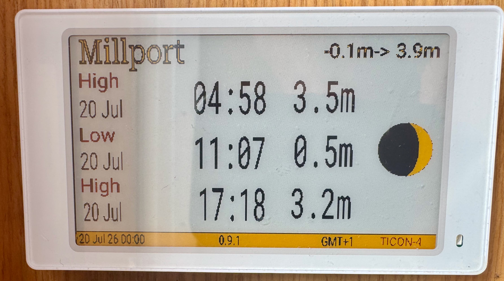

# eInk Labels for SignalK

A SignalK plugin to display data from SignalK paths, Resource APIs and plugins on Electronic Shelf Labels (ESL) over a Bluetooth Low Energy (BLE) connection using simple SVG templates, or optionally created from a crafted prompt by GenAI if the companion [`@rhizomatics/signalk-einklabel-genai-plugin`](https://github.com/rhizomatics/signalk-einklabel-genai-plugin) is installed. Supports ESLs from two of the major Chinese manufacturers, and requires **no firmware or hardware modifications**, switch on and go.

## What is an ESL?

Electronic Shelf Labels are [eInk](https://en.wikipedia.org/wiki/E_Ink) devices that consume very little battery energy, presuming they are not constantly updated - the battery is used only when the display changes (which can take 5-10 seconds) and a periodic BLE check for incoming changes. Perfect for info that changes only once or twice a day, like tidal information.

Since they are designed to be used in large quantity in small shops, they are cheap and simple devices. Earlier models required dedicated controllers, or updates over Wifi or NFC, whereas many modern ones are standalone BLE devices that can be updated from a phone or server.

Being battery operated, they can be stuck on anywhere without wiring - the only location constraints are bluetooth range, visibility (they need ambient light since the display is more like paper than a traditional lit-up electronic display) and, for some labels, being out of the weather if they are not waterproof, although IP65 labels are available.

## Quick Start

1. Check the [pre-requisites](https://signalk-einklabel.rhizomatics.org.uk/getting-started/#pre-requisites) - mainly a Linux SignalK server with a Bluetooth Low Energy adapter, or the SignalK BLE Manager API
2. Install **eInk Label Displays** from the **SignalK AppStore** ( under _Apps & Plugins_ )
3. In the plugin config, add a label, choose **"All discovered devices"** and a template such as the [Tide Clock](https://signalk-einklabel.rhizomatics.org.uk/examples/tide-clock/)

## Documentation

Full documentation is at [signalk-einklabel.rhizomatics.org.uk](https://signalk-einklabel.rhizomatics.org.uk):

- [Getting Started](https://signalk-einklabel.rhizomatics.org.uk/getting-started/) - pre-requisites, installation, setting up a label, and which labels to buy
- [Templates](https://signalk-einklabel.rhizomatics.org.uk/templates/) - how templates work, binding them to SignalK data, and designing your own
- [Examples](https://signalk-einklabel.rhizomatics.org.uk/examples/) - the bundled templates, with the sizes and data each one uses
- [Bluetooth](https://signalk-einklabel.rhizomatics.org.uk/bluetooth/) - choosing an adapter and keeping Bluetooth reliable
- [FAQ](https://signalk-einklabel.rhizomatics.org.uk/faq/) - answers to common problems
- [Command Line Interface](https://signalk-einklabel.rhizomatics.org.uk/cli/) - the `esl-cli` tool for testing templates and labels without SignalK
- [Extending](https://signalk-einklabel.rhizomatics.org.uk/extending/) - adding label hardware or new ways of producing content

## Other ESL and General eInk Resources

### Components

- [Open ePaper Link](https://openepaperlink.de) - Alternative open source firmware to flash onto eInk shelf labels, with Home Assistant integration.
- [zhsunyco-esl](https://github.com/roxburghm/zhsunyco-esl) - Python interface
- [WoLink](https://github.com/NickWaterton/Wolink) - Python interface and protocol analysis
- [e-ink dashboard for Signal K](https://github.com/meri-imperiumi/dashboard) - Waveshare display based multi instrument display.
- [eInk Dashboard Modern SK](https://github.com/VladimirKalachikhin/e-inkDashboardModernSK) - SignalK dashboard for non-ESL eInk display.
- [esp32-esl-system](https://github.com/giobauermeister/esp32-esl-system) - Docker and ESP32 based system for updating ESLs.
- [hass-gicisky](https://github.com/eigger/hass-gicisky) - Home Assistant integration for Gicisky ESLs ( a similar vendor to Zhsunyco). Uses [imagespec](https://github.com/eigger/imagespec) for templating.
- [ha-panda](https://github.com/moryoav/ha-panda) - Home Assistant integration for Panda ESLs ( a similar vendor to Zhsunyco).

### Notes and Experiences

- [Cabalist Gicisky Image Notes](https://github.com/Cabalist/gicisky_image_notes)
- [Dmitry.gr](https://dmitry.gr/?r=05.Projects&proj=29.%20eInk%20Price%20Tags) - Personal site of an ESL hacker
- [Aaron Christobel](https://www.youtube.com/@atc1441) - YouTube channel of an ESL hacker.
- [rbaron.net](https://rbaron.net/blog/2022/07/29/Daisy-chaining-multiple-electronic-shelf-labels) - Blog of an early ESL hacker.
  ### Retail
- [Pimoroni](https://shop.pimoroni.com/collections/displays?tags=e-ink%20Displays) - All shapes and sizes of eInk displays, aimed at hackers, and with an [inky](https://github.com/pimoroni/inky) GitHub project to support them.
- [WaveShare](https://www.waveshare.com/product/displays/e-paper.htm) - Wide range of eInk displays for hardware projects, not limited to ESLs.

See also the [Boat Tech Directory](https://boat-tech-directory.rhizomatics.org.uk).
