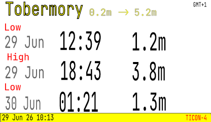
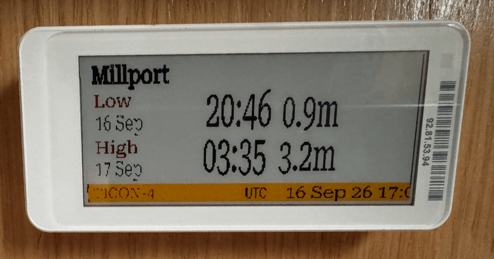

# Tide Clock

Template available as 416x240-BWRY for 3.7" ESLs and a simpler template, sized 250x128, also BWRY, for the cheapest 2.13" labels.

This mini tide clock is a 2.9" Gicisky device, less than £10 inc delivery in summer 2026.

## Pre-requisites

A _tides_ provider plugin for the Resources API installed and enabled, currently one of:

- [signalk-tides](https://github.com/openwatersio/signalk-tides) - uses [neaps](https://github.com/openwatersio/neaps) library for international off-line coverage
- [signalk-mareas-ihm](https://github.com/Aitonos/signalk-mareas-ihm) - interfaces with official Spanish IHM tidal predictions, or falls back to Open Meteo and _signalk-tides_

For versions with the moon phases:

- [signalk-derived-data](https://github.com/SignalK/signalk-derived-data) - unlike other plugins, this publishes lunar and solar facts as SignalK paths

The moon phase is optional - without it, the moon icon is simply left blank and the rest of the tide clock still shows.

The [tides](https://github.com/rhizomatics/signalk-einklabel-plugin/blob/main/templates/tides/) templates can be customized to run with any tide provider, a specific one, or switch to other APIs or SignalK data paths.

- In the template it uses a SVG description like `source=resources,resource=tides,provider=tides,path=extremes[0].time,format=local_time` to get the first tide time, ensures it's the preferred `signalk-tides` provider and makes it a simple local time rather than a UTC date-time.

To show the lunar phase, the `environment.moon.phaseName` path is required, which can be easily achieved by installing and configuring the `derived-data` plugin.

> [!TIP]
> If testing this without a boat, you'll need another plugin to provide `navigation.position` and `navigation.datetime` to make the moon and tide calcuations work. [signalk-datetime](https://github.com/tmcolby/signalk-datetime) can be configured for the datetime, and [signalk-sailboat-simulator](https://github.com/macjl/signalk-sailboat-simulator) for the postion; other ways may work too.

## Template Reference

The `tides` template family picks the best size for each label automatically - see [Template Families](../templates.md#template-families-multiple-panel-sizescolours).

<!-- BEGIN GENERATED: template-reference tides -->
<!-- Generated from the bundled templates by `npm run docs:templates` - do not edit by hand. -->

**Template:** `tides`

| File                                                                                                                           | Size (px) | Aspect ratio | Colours                   | Fits these labels exactly                                                |
| ------------------------------------------------------------------------------------------------------------------------------ | --------- | ------------ | ------------------------- | ------------------------------------------------------------------------ |
| [`tides/416x240-BWRY.svg`](https://github.com/rhizomatics/signalk-einklabel-plugin/blob/main/templates/tides/416x240-BWRY.svg) | 416 × 240 | 1.73 : 1     | black, white, red, yellow | Zhsunyco 3.7" BWRY                                                       |
| [`tides/296x128-BWRY.svg`](https://github.com/rhizomatics/signalk-einklabel-plugin/blob/main/templates/tides/296x128-BWRY.svg) | 296 × 128 | 2.31 : 1     | black, white, red, yellow | Zhsunyco 2.9" BWRY, Gicisky 2.9" BW, Gicisky 2.9" BWR, Gicisky 2.9" BWRY |
| [`tides/250x128-BWRY.svg`](https://github.com/rhizomatics/signalk-einklabel-plugin/blob/main/templates/tides/250x128-BWRY.svg) | 250 × 128 | 1.95 : 1     | black, white, red, yellow | Zhsunyco 2.13" BWRY, Gicisky 2.1" BWR                                    |

**Data used**

| Source                              | Path                         | Options                               | Used in                    |
| ----------------------------------- | ---------------------------- | ------------------------------------- | -------------------------- |
| `tides` resource (provider `tides`) | `extremes[n].label`          | -                                     | all                        |
| `tides` resource (provider `tides`) | `extremes[n].level`          | category `depth`                      | all                        |
| `tides` resource (provider `tides`) | `extremes[n].time`           | format `local_time`, format `day_mon` | all                        |
| `tides` resource (provider `tides`) | `station.datums.HAT`         | category `depth`, round 1             | 416x240-BWRY               |
| `tides` resource (provider `tides`) | `station.datums.LAT`         | category `depth`, round 1             | 416x240-BWRY               |
| `tides` resource (provider `tides`) | `station.name`               | -                                     | all                        |
| `tides` resource (provider `tides`) | `station.source.name`        | -                                     | 416x240-BWRY, 296x128-BWRY |
| Plugin                              | `local_zone`                 | -                                     | 416x240-BWRY, 296x128-BWRY |
| Plugin                              | `plugin_version`             | -                                     | 416x240-BWRY               |
| Plugin                              | `repainted`                  | format `local_datetime_short`         | all                        |
| Signal K path                       | `environment.moon.phaseName` | image from `lunar_phases`             | 416x240-BWRY               |

<!-- END GENERATED -->

The original single-file version is also still available as `tide.svg`:

<!-- BEGIN GENERATED: template-reference tide.svg -->
<!-- Generated from the bundled templates by `npm run docs:templates` - do not edit by hand. -->

**Template:** `tide.svg`

| File                                                                                               | Size (px) | Aspect ratio | Colours | Fits these labels exactly |
| -------------------------------------------------------------------------------------------------- | --------- | ------------ | ------- | ------------------------- |
| [`tide.svg`](https://github.com/rhizomatics/signalk-einklabel-plugin/blob/main/templates/tide.svg) | 416 × 240 | 1.73 : 1     | -       | Zhsunyco 3.7" BWRY        |

**Data used**

| Source                              | Path                         | Options                               |
| ----------------------------------- | ---------------------------- | ------------------------------------- |
| `tides` resource (provider `tides`) | `extremes[n].label`          | -                                     |
| `tides` resource (provider `tides`) | `extremes[n].level`          | category `depth`                      |
| `tides` resource (provider `tides`) | `extremes[n].time`           | format `local_time`, format `day_mon` |
| `tides` resource (provider `tides`) | `station.datums.HAT`         | category `depth`, round 1             |
| `tides` resource (provider `tides`) | `station.datums.LAT`         | category `depth`, round 1             |
| `tides` resource (provider `tides`) | `station.name`               | -                                     |
| `tides` resource (provider `tides`) | `station.source.name`        | -                                     |
| Plugin                              | `local_zone`                 | -                                     |
| Plugin                              | `plugin_version`             | -                                     |
| Plugin                              | `repainted`                  | format `local_datetime_short`         |
| Signal K path                       | `environment.moon.phaseName` | image from `lunar_phases`             |

<!-- END GENERATED -->
