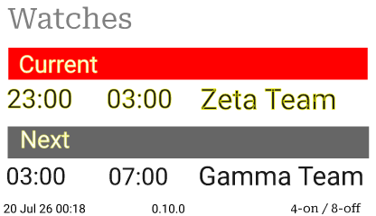

# Watch Schedule

Template available as 416x240-BWRY for 3.7" ESLs.

## Pre-requisites

- Source of `watch.current` and `watch.next` values
  - `signalk-watch-schedule` plugin

## Template Reference

<!-- BEGIN GENERATED: template-reference watch -->
<!-- Generated from the bundled templates by `npm run docs:templates` - do not edit by hand. -->

**Template:** `watch`

| File                                                                                                                           | Size (px) | Aspect ratio | Colours                   | Fits these labels exactly |
| ------------------------------------------------------------------------------------------------------------------------------ | --------- | ------------ | ------------------------- | ------------------------- |
| [`watch/416x240-BWRY.svg`](https://github.com/rhizomatics/signalk-einklabel-plugin/blob/main/templates/watch/416x240-BWRY.svg) | 416 × 240 | 1.73 : 1     | black, white, red, yellow | Zhsunyco 3.7" BWRY        |

**Data used**

| Source        | Path                      | Options                       |
| ------------- | ------------------------- | ----------------------------- |
| Plugin        | `plugin_version`          | -                             |
| Plugin        | `repainted`               | format `local_datetime_short` |
| Signal K path | `watch.current.endTime`   | format `local_time`           |
| Signal K path | `watch.current.startTime` | format `local_time`           |
| Signal K path | `watch.current.teamName`  | -                             |
| Signal K path | `watch.next.endTime`      | format `local_time`           |
| Signal K path | `watch.next.startTime`    | format `local_time`           |
| Signal K path | `watch.next.teamName`     | -                             |
| Signal K path | `watch.system.name`       | -                             |

<!-- END GENERATED -->
