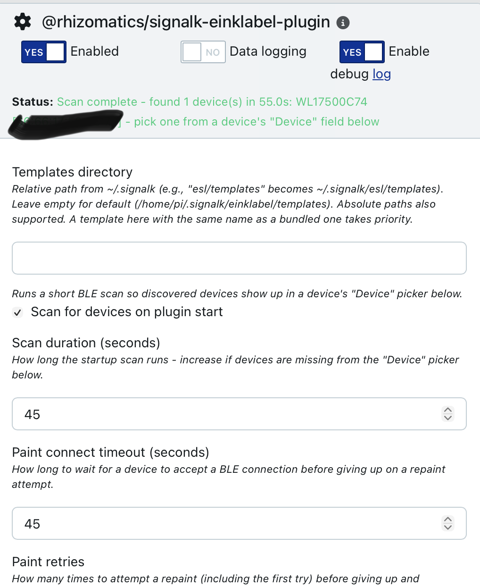
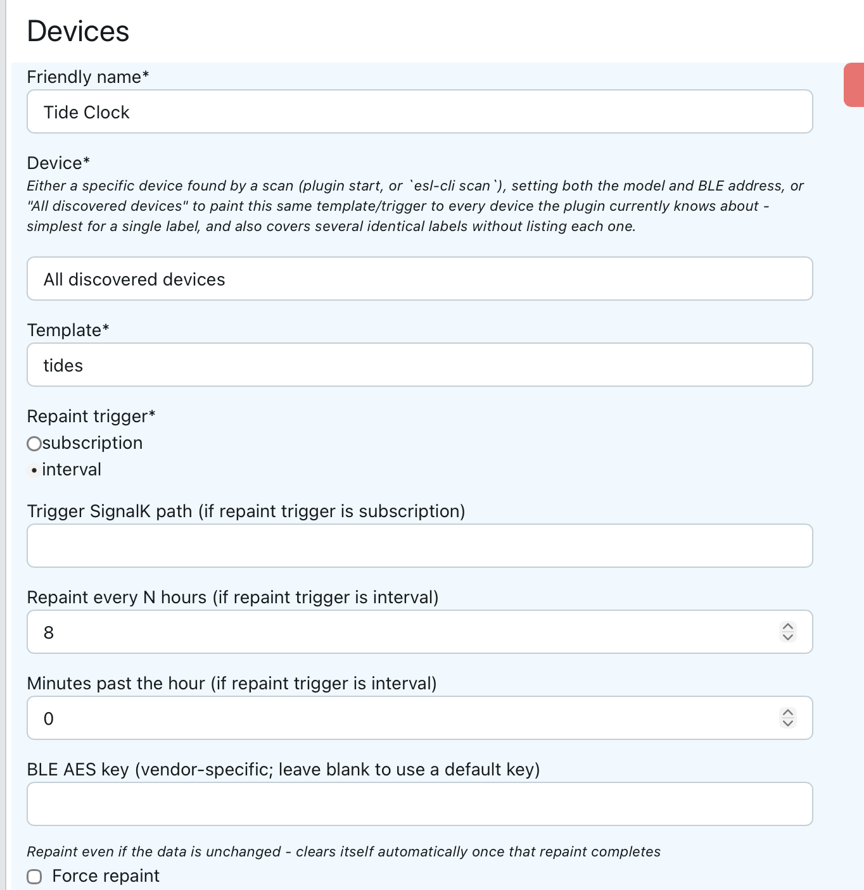

# Getting Started

## Pre-requisites

Unlike some eInk projects, this plugin doesn't require any physical modification to the labels, or loading any new firmware. It can send an image to a supported shelf label fresh out of the box.

Most of requirements below are to make SignalK work with Bluetooth Low Energy, which is good thing to have anyway, since vendors like Victron, Switchbot, Ruuvi and others have BLE enabled hardware that's useful to have on a boat.

This plugin can reach BLE hardware two ways - pick whichever fits your setup:

- **Direct BlueZ access** (default) - the plugin talks to BlueZ over D-Bus itself. Requirements 1-3 below apply.
- **SignalK BLE Manager API** (opt-in) - SignalK server >= 2.32.0 ships a [BLE Provider/Consumer API](https://github.com/SignalK/signalk-server/issues/2411) (admin UI: "BLE Manager") that arbitrates adapter access across every BLE-consuming plugin instead of each one grabbing `hci0` for itself, and can source BLE over a remote gateway instead of local hardware at all. Enable the "Use the SignalK BLE Manager API" setting in this plugin's config once it's available (it only appears once the running server has it) - requirements 1-3 below then become the SignalK server's problem, under its own Bluetooth admin settings, not this plugin's.

1. A SignalK server, **running Linux** (direct BlueZ mode only - BLE Manager mode with a remote gateway provider has no such requirement)

- MacOS and Windows aren't supported by the [BLE interface layer](https://www.npmjs.com/package/@naugehyde/node-ble) in direct BlueZ mode, however they can be used for template development and
  debugging (everything except `scan` and `paint`)

2. A Bluetooth adapter, that can handle BLE (Bluetooth Low Energy) - direct BlueZ mode only; in BLE Manager mode this is whatever the server's own Bluetooth settings provide.

- Bluetooth adapters for Linux can be tricky - see [Choosing a Bluetooth Adapter](bluetooth.md#choosing-a-bluetooth-adapter) for advice

3. `bluez` package installed in Linux - direct BlueZ mode only

- No need to do this if you have a Raspberry Pi with recent Raspian version, since bluez comes built in.
- If you're not running a Raspberry Pi, then ensure that the `dbus` package is installed

4. One or more supported Electronic Shelf Labels

- The labels used for testing this are the [Zhsunyco 3.7" BWRY](https://www.aliexpress.com/item/1005010050104435.html) and a [Gicisky 2.9" BWRY](https://www.aliexpress.com/item/1005012933325056.html) - see [Supported Labels](#supported-labels)

5. Correct time zone set on server if local time is to be shown on display

- See [Times are showing incorrectly](faq.md#times-are-showing-incorrectly)
- If not set, everything will work, but you may see the wrong zone or not have daylight savings applied

Once you have all of that, it may be worth also installing [signalk-victron-ble](https://github.com/stefanor/signalk-victron-ble), [signalk-ruuvitag-plugin](https://github.com/vokkim/signalk-ruuvitag-plugin) or [bt-sensors-plugin](https://github.com/naugehyde/bt-sensors-plugin-sk) to pull in data from other sensors and equipment.

## Installation

Look for **eInk Label Displays** in the **SignalK AppStore** on your
server ( under _Apps & Plugins_ on the latest version).

### Using Outside of SignalK

The plugin can also be installed as a stand-alone module, which can be useful for designing templates away from the boat, and makes available the `esl-cli` command line tool for scanning devices and debugging templates - see [Command Line Interface](cli.md).

```bash
npm install @rhizomatics/signalk-einklabel-plugin
```

## Configuration

Use the standard configuration option in the SignalK menu for the plugin.



## Setting up a Label

Enable the plugin, and use the large **+** sign to add a label, which opens up these fields.



- _Friendly Name_ - Give the label any name (word or phrase) you like, for example 'Tide Clock'
- _Device_ - Unless you have multiple labels, don't bother with pre-scanning or selecting a specific device, instead pick **"All discovered devices"** and it will paint any compatible labels it finds. If you want to pick a specific device, you'll need to wait for a device scan to complete.
- _Template_ - Choose a built-in template (see [Examples](examples/README.md)), one you've added to the local templates directory, or - if a companion plugin like [`@rhizomatics/signalk-einklabel-genai-plugin`](templates.md#genai-rendering) is installed - one of its own contributed entries (shown with a suffix, e.g. "forecast (GenAI)")
- _Location/description_ - Optional free-text notes on where this label is physically mounted/viewed from, e.g. "chart table, viewed from ~1m in poor light" - available to any template as `source=label,path=description` (see [Label Details](templates.md#label-details))
- _Repaint Trigger_- Do you want this to repaint every few hours (at a chosen minutes past hour), or when a SignalK path changes?
  - If it's a SignalK path, enter it next, for example `environment.tide.state`
  - If it's time based, enter how many hours between repaints, for example 00:00/08:00/16:00 for an 8h schedule, and if you want a specific number of minutes after the hour.

The rest are grouped under _Advanced settings_, and can usually be ignored.

- _If the render doesn't match the panel size_ - see [Reframing](templates.md#reframing)
- _Compress upload_, _Mirror_ and _Wire format_ - see [Other Image Options](templates.md#other-image-options)
- _Force Repaint_ - Next time the label is due to be painted, update even if the data or template hasn't changed (this flag will automatically be cleared after this.)
- _BLE AES key_ - Only needed if the default key doesn't work and you have a better alternative, otherwise ignore
- _Paint connect timeout_ and _Paint retries_ for this device - leave blank to use the plugin-wide settings, or set them for a label that's slower to respond or further away than the others

Configs saved by earlier versions are moved into this layout automatically when the plugin starts.

When the plugin starts, it will automatically re-paint the label if it's new, or the last timed slot was missed and the data has changed.

### Scanning for Devices

Since these are ultra-low power devices, they don't respond instantly to either identify themselves or accept a new image. By default, both scanning and painting have time-outs to wait for a response, which can be altered in the plugin configuration or CLI argument.

One other quirk is that some devices respond with a different name at different times, for example the generic `WOESL` sometimes and model specific `WL17500C74` other times. However, the MAC address, e.g. `66:66:17:50:0D:2B` is constant, and this is what's tracked by the plugin.

The plugin can optionally re-scan whenever it starts up (off by default), although this isn't essential once a label has been configured. Devices found by any scan are remembered across restarts - see [Troubleshooting](faq.md#i-cant-see-my-device-as-a-choice-on-the-drop-down-list-after-scan).

## Supported Labels

### Zhsunyco

Also known as 'Suny' and 'WOLink'.

- [BLE ESLs](https://www.zhsunyco.com/digital-display-solution-for-small-retail-business/ble-esl-solution/)
  - The range of labels available on retail sites like AliExpress may be larger than on their corporate site
  - In mid 2026, a 4 colour (BWRY) 3.7" label retailed for about $35, with quantity discounts for bulk sets
  - Cheapest units are 2 colour 1.54", and they go up to 7.5"

Python code for a variety of their labels at https://github.com/roxburghm/zhsunyco-esl and https://github.com/NickWaterton/Wolink

### Gicisky

Known by other names, e.g. 'Picksmart', and with white label brands

- BLE ESLs
  - Official store is on [AliExpress](https://www.aliexpress.com/store/911771479/pages/all-items.html?productGroupId=40000001654819&spm=a2g0o.store_pc_home.pcShopHead_6000727597996.1_1)
  - Cheapest labels under £10 GBP / $13 USD
