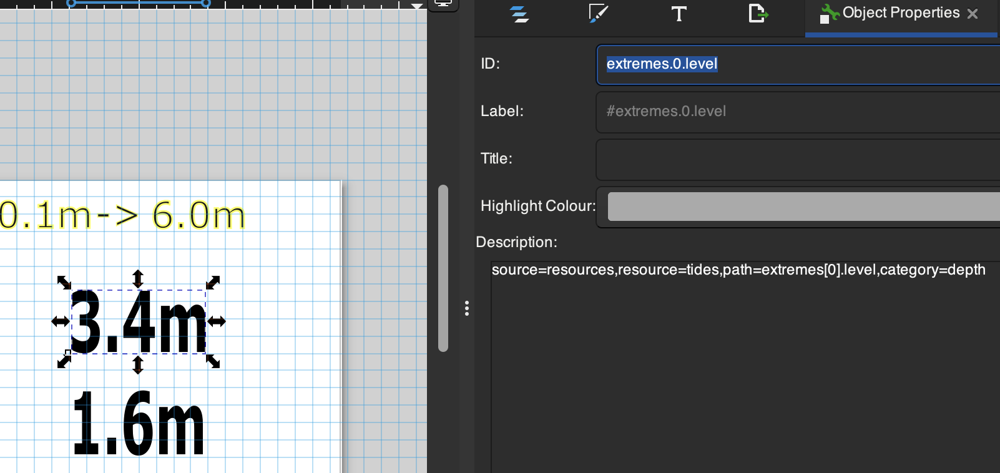

# Templates

Templates are simply SVG files, to which expressions can be added to use SignalK data, with options to make it easier to read, like rounding or simplifying dates and times. The template can have sample data in the placeholder, so is easy to layout and visualize.

The bundled templates, with the sizes and data each one uses, are listed under [Examples](examples/README.md).

## Template Families (multiple panel sizes/colours)

A "Template" selection can either be one specific `.svg` file, or a _directory_ holding several versions of the same template for different panel sizes/colour-sets, e.g. `templates/tides/416x240-BWRY.svg` and `templates/tides/250x128-BWRY.svg` both implement the tide clock, just at different sizes.

Each template is named `<width>x<height>-<colours>.svg`, where `<colours>` is one letter per supported colour: `B`(lack)/`W`(hite)/`R`(ed)/`Y`(ellow) - e.g. `BWRY` for a 4-colour panel, `BWR` for a 3-colour one.

Selecting the directory (e.g. `tides`) instead of one file lets one `DeviceConfig` entry - especially a `device: "All discovered devices"` entry covering several different physical panels - automatically pick the best-fitting file for each device's actual size/colours, trying in order:

1. An exact width/height/colour-set match.
2. Failing that, width/height alone (any colour-set).
3. Failing that too, the nearest width, tie-broken by whichever file's own height/width ratio is closest to the device's.

## Reframing

There's some wiggle room with the `reframe` options to use a template that's a bit too small, or too large, for the label, although best results come from a template that's precisely matching the pixel height and width of the label. Next best is template that has the same aspect ratio, so it can be cleanly scaled. `crop` is the 2nd least worst, though if its only a handful of pixels its often not worth worring about a separate template and `crop` is just fine. `scale` is likely to look worst, since it will force an image in regardless of aspect ratio.

## Other Image Options

Each label has a few more settings for how the image is sent, under _Advanced settings_. The CLI `paint` command has matching options (see [Command Line Interface](cli.md)), so you can try them on a label before changing the plugin config.

- _Compress upload_ - on by default. Sends much less data over Bluetooth, so painting is quicker, uses less of the label's battery and is less likely to time out. Works for Zhsunyco labels and Gicisky 7.5"/10.2" labels, and is ignored for others. Turn it off if a label stops updating.
- _Wire format (Gicisky, experimental)_ - `auto` by default. `chunked` sends a Gicisky 4.2" BWR label compressed, the same way as the 7.5"/10.2". The vendor's own app has been seen doing this, but it hasn't been tested on current firmware. Set it back to `auto` if the label stops updating.
- _Mirror_ - `none` by default. `horizontal` or `vertical` fixes a label model whose image comes out mirrored. `both` rotates the image 180°, for a label that has to be mounted upside down.

## Template Source Specification

In the `description` of the SVG text box, use a comma separated set of key value pairs to define the data source and formatting.

### SignalK Paths

For example, `path=environment.forecast.description` uses the default data source (the `self` vessel context) and the named SignalK path. A bare path with no key/value pairs at all, e.g. just `environment.forecast.description`, is shorthand for the same thing. Overriding the default context can be done with `path=environment.forecast.description,context=vessels.urn:mrn:imo:mmsi:232345678` - the `context` value must match a real SignalK context exactly as it appears in the Data Browser.

### SignalK REST APIs

The source can be overridden to use the SignalK server's Resources API instead. Change `source` to `resources` and specify which resource with `resource`. If there are multiple providers for the same resource, and they're not equally useful, then either set a default provider in SignalK, or use the `provider` tag to set the name.

For example, `source=resources,resource=tides,provider=tides,path=station.name` picks the `tides` resource and pulls the `station.name` path out of the JSON response - this works for any resource type (`tides`, `waypoints`, `routes`, ...), and needs nothing configured: the plugin reaches the Resources API directly. Where a resource is specified, it will be fetched once for that render, and subsequent fields sourced from the same resource use that cached response. `provider` is optional, the default provider will be used if not specified.

### Plugin Derived Data

`source=einklabel` reads data injected by the plugin itself, rather than from SignalK. Available paths:

- `path=repainted` - the timestamp of the current repaint - for example `source=einklabel,path=repainted,format=local_datetime_short` to show when the label was last updated.
- `path=local_zone` - a short zone name (e.g. `BST`) for the same timezone used for `local_time`/`day_mon`/`local_datetime_short` (see above) - a fallback for `environment.time.timezoneRegion,format=utc_offset` on installs that never publish that path, since it needs no SignalK metadata of its own. Falls back to a plain UTC offset like `GMT+1` where the host's locale has no real abbreviation for the zone.
- `path=plugin_version` - expose the version of the eInk Label plugin itself.

### Label Details

`source=label` reads facts about the label being painted, so one template can adapt to different labels. Available paths:

- `path=description` - the label's _Location/description_ setting, e.g. `source=label,path=description`
- `path=manufacturer` - the label's maker, e.g. `Zhsunyco`
- `path=label` - the model's panel size, e.g. `3.7"`
- `path=width` and `path=height` - the panel size in pixels
- `path=colours` - the colours the panel can show, e.g. `black (#000000)`; add `format=csv` for a plain comma-separated list
- `path=fonts` - the font families that are always available: `serif`, `sans-serif` and `monospace`
- `path=position` - the vessel's position, rounded to about 1km

These also work in the fallback warning shown when a template fails to render. Changing a label's description repaints it.

### Customizing Output

A `format` can be specified to make the value easier to understand. The supported formats are:

- `local_time` - reduce a time stamp to just the time (H:M:S), omitting the date, and applying daylight savings if appropriate
- `day_mon` - reduce a time stamp to day and month, e.g. `27 Jun`, applying daylight savings if appropriate
- `local_datetime_short` - format a time stamp as day, abbreviated month, 2-digit year and 24h time, e.g. `21 Jun 26 18:05`, applying daylight savings if appropriate
- `utc_offset` - Show a timezone in `UTC+01:00` style format
- `position` - Format a `{ latitude, longitude }` value as decimal degrees with hemisphere letters, e.g. `56.6250°N 6.0700°W`
- `raw` - Don't apply automatic SignalK unit conversion and symbol display (see below)

SignalK's unit preferences are used to automatically convert a `signalk`-sourced numeric value to its preferred display unit, and append a unit symbol like `kt` or `m`, unless `format=raw` is specified to switch that off. However, when using plugin or API data there may be no path metadata to convert from (for example `signalk-tides` publishes tide data to the Resources API, and `level` is a raw metre value with no SignalK path of its own) - in these cases an explicit `category` can be given instead, and the unit preferences will be applied the same way, for example `category=depth` for the tides level figure.

Note that for dates and times, the server timezone must be set correctly, for example `Europe/London` rather than the default `Etc/UTC` - see [Times are showing incorrectly](faq.md#times-are-showing-incorrectly).

#### Common categories

- `depth` - Use the SignalK preferred depth unit, make the conversion if needed, and tack on the unit name as a suffix
- `speed` - Use the SignalK preferred speed unit, make the conversion if needed, and tack on the unit name as a suffix
- `temperature` - Use the SignalK preferred temperature unit, make the conversion if needed, and tack on the unit name as a suffix

Additionally, `round=n` can be used to round to limited decimal places.

`default=<value>` substitutes `<value>` whenever the resolved value is missing (e.g. an unpublished path), instead of falling through to an empty string - useful anywhere a blank would be misread as a real answer. `default=` with nothing after the `=` still counts as set, deliberately defaulting to an empty string rather than leaving the fallback behaviour unchanged.

These can all be combined as in `source=resources,resource=tides,provider=tides,path=extremes[2].level,category=depth,round=2`

## Non-Textual Fields (Images)

The same `<desc>` mechanism works on an `<image>` element instead of a `<text>` element, for a value that's better shown as a picture than as text - a moon phase icon, a wind direction arrow, a weather condition glyph, and so on. Rather than substituting text, the resolved value picks one of a directory of `.svg` files to embed, by an extra required `assets=` key naming that directory - an `.assets/<name>` sub-directory looked up in your configured `templates` directory first, and the bundled `templates` directory otherwise. For example, the tide clock's moon phase icon uses:

```
path=environment.moon.phaseName,assets=lunar_phases
```

which resolves against `templates/.assets/lunar_phases/` (bundled, or your own configured `templates` directory's `.assets/lunar_phases/` if you have one). The resolved value (e.g. `"Waning Gibbous"`, as published by the [derived-data](https://www.npmjs.com/package/signalk-derived-data) plugin) is normalized to match a filename - lower-cased, punctuation and spaces collapsed to underscores - so `"Waning Gibbous"` picks `waning_gibbous.svg` out of that directory. If the underlying path has no value at all (e.g. the `derived-data` plugin isn't installed), or the value doesn't normalize to any file in the directory, the `<image>` element is omitted from that render - no broken image, no placeholder, nothing shown - and a line is logged to the console so a missing/unmatched value isn't silently invisible.

If you don't like the bundled moon phase icons, save your own `<value>.svg` files in the `.assets/lunar_phases` sub-directory of your configured `templates` directory - the whole directory is used in place of the bundled one, so add all 8 phases you want to keep, not just the ones you're changing. These moon phases can be re-used in any other label.

This is a general mechanism, not specific to moon phases - any `source`/`context`/`path`/`format` combination valid for a `<text>` binding works here too (a `source=resources` value, an explicit `category=`, etc.), the only difference is the required `assets=` directory and the "no match -> no image" behaviour instead of substituted text. To add your own, put a directory of `<value>.svg` files under an `.assets/<name>` sub-directory of your `templates` directory, add an `<image>` element in your SVG editor at the size/position you want, and give it a `<desc>` the same way you would a text field - overriding just the template, just its assets, or both together, all work independently.

## Fonts

Three font types are loaded by default, use the generic font family, or exact font name, in the SVG editor and choose size and weight (bold, semi-bold etc). Some labels will make a decent attempt to gray scale. Use the simple pure red, yellow, white, black to match the label's limited colour choice (some labels only offer black and white, or black/white/red). If a font can't be matched it will default to (sans-serif) Roboto.

- `serif` - `Roboto Serif`
- `sans-serif` - `Roboto`
- `monospace` - `Roboto Mono`

## Designing Templates

Templates can be added to the configurable directory. [Inkscape](https://inkscape.org) free, open source, and recommended for editing templates, or your own favourite editor, or by hand in a text editor for hard core (or just tidying up the template side).



The object ID and label aren't used by the plugin, only the description is used to define fields. You can also add in ordinary text fields without field definitions, as labels, logos, help text etc.

Placeholder text isn't necessary, and is ignored by the plugin, but makes it much easier to visualize the result.

Inkscape adds its own metadata to images, which can be stripped off by exporting a simple SVG, although can be left in place with no harm; main reason to simplify the SVG is manual changes in a text editor.

Due to a limitation in the `resvg-wasm` library used to turn SVGs into images, the `font-family` is limited to `serif`,`sans-serif`,`monospace` or the exact name of one of the installed fonts - `Roboto` (sans serif), `Roboto Serif` or `Roboto Mono`.

Inkscape has its own fonts, which won't match what's available in the SignalK plugin, so for more precise design, install [Roboto from Google](https://fonts.google.com/specimen/Roboto) via the web page, `brew` on MacOS or similar.

To try a template out without a label, or even without a SignalK server, use the CLI's `render` and `fields` commands - see [Debugging Templates](cli.md#debugging-templates).

## GenAI Rendering

As an alternative to hand-designed SVG templates, a device's content can be generated by an LLM instead - this is provided entirely by a separate companion plugin, [`@rhizomatics/signalk-einklabel-genai-plugin`](https://github.com/rhizomatics/signalk-einklabel-genai-plugin), not by this core plugin. The base plugin (BLE painting, SVG templates) has nothing to do with any LLM SDK or API key, so installing it never pulls in GenAI dependencies unless you also explicitly install and enable the companion plugin - the split is deliberate, for anyone on a small/constrained install or who'd simply rather not have any GenAI code in their install at all.

Once the companion plugin is installed and enabled, its own config screen handles provider/model/API-key selection (OpenAI, Anthropic, Google, xAI, DeepSeek, Moonshot AI, Ollama, or any other OpenAI-compatible endpoint), and its prompts show up as ordinary entries in this plugin's "Template" dropdown, suffixed (e.g. "forecast (GenAI)") - pick one exactly like you'd pick a `.svg` file. Under the hood it's a `TemplateProvider` (see [Template Providers](extending.md#template-providers)) - the same extension mechanism a new vendor's hardware driver uses - so from this plugin's point of view it's just another way `templateName` gets resolved to an image.

If the LLM call fails (network/API error, exhausted retries) or its response isn't renderable, this core plugin pushes its own bundled warning template instead of leaving the previous, possibly now-wrong, content on screen - so a stale weather prompt never quietly shows yesterday's forecast through today's storm. This is a generic safety net, not GenAI-specific: the exact same fallback covers a broken hand-authored template failing to render at all. The next scheduled repaint retries automatically. Since each repaint may call a (usually paid) LLM API, a GenAI-backed device should use Repaint Trigger `interval`, not `subscription`.

See the companion plugin's own README for installing it, writing prompts, and its `esl-cli prompt`/`generate` commands for testing prompts without a device.
